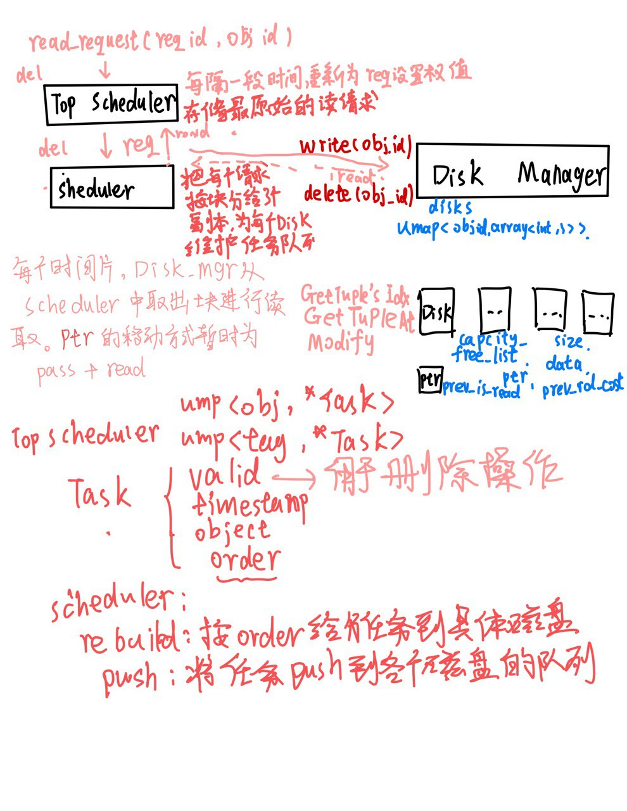

# DiskScheduler

## todo

- [x] 写一个能跑的框架 

- [x] 分页存储 remake

- [x] TopScheduler 根据磁盘的情况分配任务（负载均衡，磁头的位置，到目的地的距离）

- [x] 磁头根据距离决定移动方案

- [ ] 设计 RTQ

- [ ] TopScheduler 安排同 TAG 在同一硬盘读

- [ ] 分析数据，比如读的时候同 TAG 的 object id 与读取请求时间的关系 



## remake please

存储你崛起吧

段式存储， 用四元组 (disk_id,disk_addr,capacity,size) 标识段， capacity 和 size，size是已经存储的块的大小，capacity 是总共管辖的块，管辖的块不能被其他tag获取，

扩容和 shrink_to_fit 函数

自动扩容 = 如果不够存 如果能直接扩展 优先从尾部扩展长度为 min(剩余最长连续块,capacity)的连续块加入段，否则加入新段

shrink_to_fit 把 首部和尾部多余的 capacity 释放 

初始化 =  根据初始化给出的读入量，找磁盘和初始位置，初始化长度为 (DEFAULT_SIZE)

碎片处理 = 考虑拆分段来释放空间

如果无法用段来维护就直接开摆

```cpp
class segment
{
    int disk_id_,disk_addr,capacity_{5},size_{0};
}
```

##
resource_allocator.h
利用模拟退火优化磁盘分配，可返回一个n*m的矩阵，表示第i个磁盘上tag为j的块大小，保证每一行和为V。
目前看来模拟退火是可以比平均分配高出5-10个百分点
磁盘碎片化还是很严重，需要进行优化